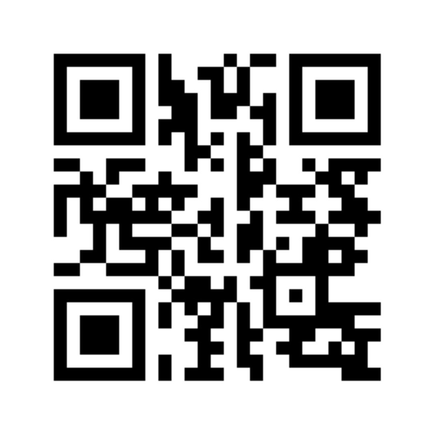

# Azure IoT Resources

Follow me on twitter **[@dglover](https://twitter.com/dglover)**

Follow Microsoft IoT on Twitter **#msiot**

[This document](https://gloveboxes.github.io/UNSW-IoT-Resources)

---

## A bit about me

[Dave Glover IoT Cloud Advocate](https://developer.microsoft.com/en-us/advocates/dave-glover?WT.mc_id=github-blog-dglover)

---

## Student Resources

* [Azure Free for Students](https://azure.microsoft.com/en-us/free/students?WT.mc_id=github-blog-dglover)

    Any UNSW student can activate with their UNSW edu.au email address.
    
    This will give you:
    * $100 of Azure credit,
    * access to the dev tools including Visual Studio,
    * and year-long access to a range of services (in addition to the $100 credit), which includes:
        * Azure IoT Central Free Trail and 2 free devces there after,
        * Microsoft IoT Hub (up to 8,000 messages a day), 
        * Azure Functions (up to 1m requests a month), 
        * SQL Server Developer Edition 
        * and heaps of different AI & Machine Learning services.

---

## Microsoft Learn

* [Microsoft Learn](https://docs.microsoft.com/en-us/learn/browse/?roles=developer&WT.mc_id=github-blog-dglover)
    Learn new skills and discover the power of Microsoft products with step-by-step guidance. Start your journey today by exploring our learning paths and modules.

---

## Resources

* [Azure IoT Central](https://azure.microsoft.com/en-au/services/iot-central/?WT.mc_id=github-blog-dglover)
* [Azure IoT Hub - Includes Quick Starts for all major languages](https://azure.microsoft.com/en-au/services/iot-hub/?WT.mc_id=github-blog-dglover)
* [Azure Custom Vision](https://azure.microsoft.com/en-us/services/cognitive-services/custom-vision-service/?WT.mc_id=github-blog-dglover)
* [Azure Cognitive Services](https://azure.microsoft.com/en-au/services/cognitive-services/?WT.mc_id=github-blog-dglover)
* [Azure Vision AI Kit](https://azure.github.io/Vision-AI-DevKit-Pages/)
* [Azure Machine Learning Studio](https://docs.microsoft.com/en-us/azure/iot-hub/iot-hub-weather-forecast-machine-learning?WT.mc_id=github-blog-dglover)
* [Azure Functions](https://docs.microsoft.com/en-us/azure/azure-functions/?WT.mc_id=github-blog-dglover)
* [Azure Logic Apps](https://docs.microsoft.com/en-us/azure/logic-apps/logic-apps-overview?WT.mc_id=github-blog-dglover)

---

### Free Training

* [Microsoft IoT Show](https://channel9.msdn.com/Shows/Internet-of-Things-Show?WT.mc_id=github-blog-dglover)
* [Getting started with Azure IoT](https://www.udemy.com/course/getting-started-with-azure-iot/)

---

## Azure IoT Certification

* [Exam AZ-220: Microsoft Azure IoT Developer (beta)](https://docs.microsoft.com/en-us/learn/certifications/exams/az-220?WT.mc_id=github-blog-dglover)

## Projects

* [Creating an image recognition solution with Azure IoT Edge and Azure Cognitive Services](https://dev.to/azure/creating-an-image-recognition-solution-with-azure-iot-edge-and-azure-cognitive-services-4n5i)
* [Build a Kubernetes "Intelligent Edge" Cluster on Raspberry Pi](https://dev.to/azure/part-1-build-a-kubernetes-intelligent-edge-cluster-on-raspberry-pi-5h3k)

---

## Web Properties

* [Internet of Things Tech Community](https://techcommunity.microsoft.com/t5/internet-of-things/bg-p/IoTBlog?WT.mc_id=github-blog-dglover)
* [GitHub github.com/gloveboxes](https://github.com/gloveboxes?tab=repositories)
* [Hackster.io www.hackster.io/glovebox](https://www.hackster.io/glovebox)
* [Dev.to https://dev.to/gloveboxes](https://dev.to/gloveboxes)

## Azure Sphere Learning Path

* [Azure Sphere Learning Path]()

---

## Simulators

* [Raspberry Pi IoT Simulator](https://docs.microsoft.com/en-us/azure/iot-hub/iot-hub-raspberry-pi-web-simulator-get-started?WT.mc_id=github-blog-dglover)